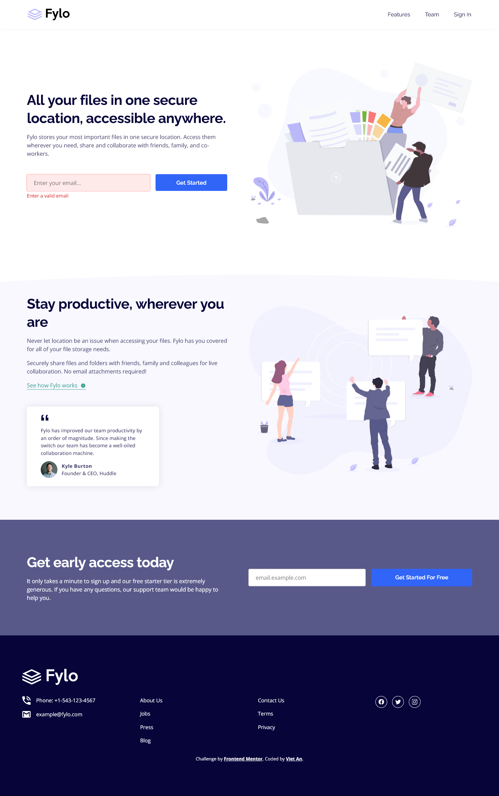

# Frontend Mentor - Fylo landing page with two column layout solution

This is a solution to the [Fylo landing page with two column layout challenge on Frontend Mentor](https://www.frontendmentor.io/challenges/fylo-landing-page-with-two-column-layout-5ca5ef041e82137ec91a50f5). Frontend Mentor challenges help you improve your coding skills by building realistic projects.

## Table of contents

-   [Overview](#overview)
    -   [The challenge](#the-challenge)
    -   [Screenshot](#screenshot)
    -   [Links](#links)
-   [My process](#my-process)
    -   [Built with](#built-with)
    -   [What I learned](#what-i-learned)
    -   [Continued development](#continued-development)
-   [Author](#author)
-   [Acknowledgments](#acknowledgments)

## Overview

### The challenge

Users should be able to:

-   View the optimal layout for the site depending on their device's screen size
-   See hover states for all interactive elements on the page

### Screenshot



### Links

- [Live Website](https://vietan0.github.io/FM-fylo-landing-page-with-two-column-layout/)
- [Solution Page on Frontend Mentor](https://www.frontendmentor.io/solutions/fylo-landing-page-with-two-column-layout-0GbMxR7kW)

## My process

### Built with

-   Semantic HTML5 markup
-   CSS custom properties
-   Flexbox
-   CSS Grid
-   Mobile-first workflow

### What I learned

- [The problem of nested \ inside \<a\>](https://developpaper.com/question/the-problem-of-a-nested-img-tag/)

```css
/* fix weird height problem */
a {
	display: inline-block;
	line-height: 0px;
}
```

- Flex-grow equals 1 makes item fill container
```css
flex-item {
	flex-grow: 1;
}
```

- [Specify width & height attributes to prevent layout shift](https://www.youtube.com/watch?v=4-d_SoCHeWE)
```html
 
```

### Continued development

- Look into responsive images

## Author

- Frontend Mentor - [@vietan0](https://www.frontendmentor.io/profile/vietan0)
- Linkedin - [@vietan](https://www.linkedin.com/in/vietan/)